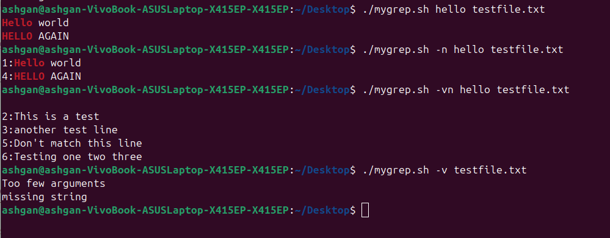

# Custom-Command
## A breakdown of how my script handles arguments and options 
The script can take three or two argument.  
  First: for the option (-n, -v, -nv, -vn), this field is optional.
  Second: for the string, this field is necessary.
  Third: for the file name, this field is necessary.
The script check if there is an option or not and make it if it exist.
The script warn about missing arguments.

## A short paragraph of how would my structure change if the script were to support regex or -i/-c/-l options
-i will not change mygrep structure because it is already case insensitive.
-c will make a function that print the count of lines have the string.
-l will make a function that print the file name if the string exist.

## The part of the script was hardest to implement
Implement the part that search for the string 

